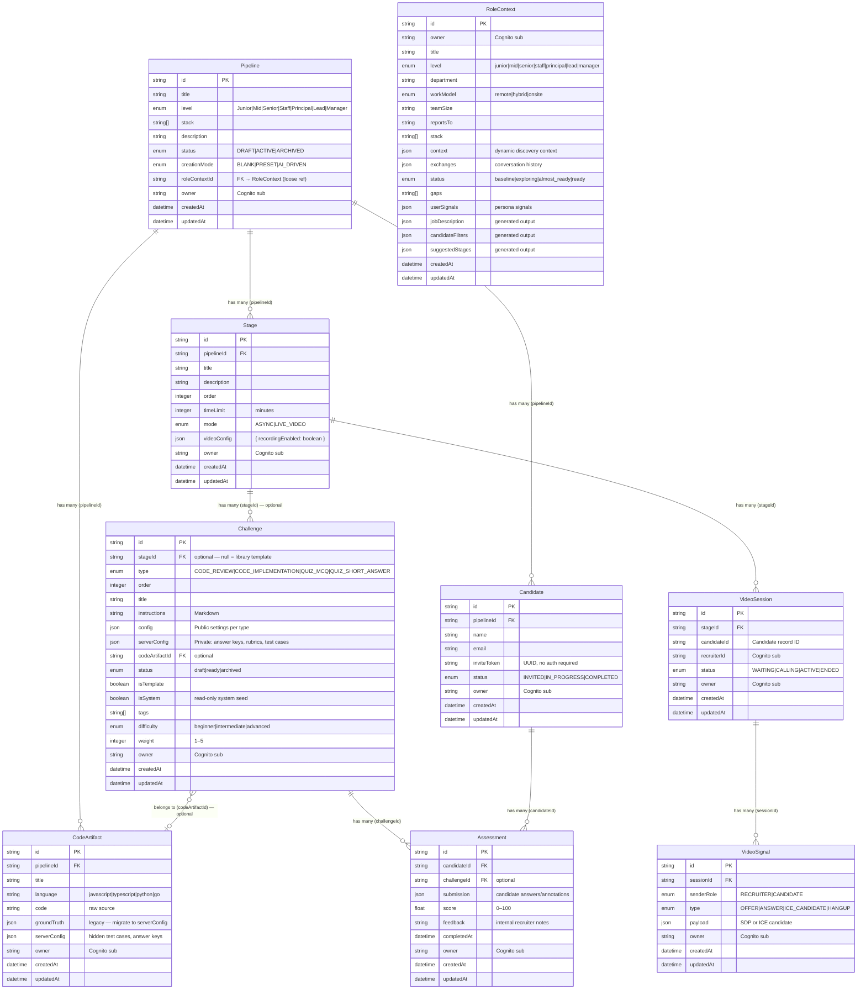

# Data Model

**Type:** Entity Relationship Diagram
**Created:** 2026-02-28
**Scope:** All Amplify Data models in `amplify/data/resource.ts`, including pending Challenge Studio additions (ADR-012)

---

## Diagram

---

## Relationship Table

| From | To | Relationship | FK | Notes |
|---|---|---|---|---|
| Pipeline | Stage | one-to-many | `Stage.pipelineId` | A pipeline owns all its stages |
| Pipeline | Candidate | one-to-many | `Candidate.pipelineId` | All candidates invited to a pipeline |
| Pipeline | CodeArtifact | one-to-many | `CodeArtifact.pipelineId` | Code snippets scoped to a pipeline |
| Stage | Challenge | one-to-many (optional) | `Challenge.stageId` | `null` stageId = library template (pending migration) |
| Stage | VideoSession | one-to-many | `VideoSession.stageId` | Live video sessions per stage |
| Challenge | CodeArtifact | many-to-one (optional) | `Challenge.codeArtifactId` | Multiple challenges can share one artifact |
| Challenge | Assessment | one-to-many | `Assessment.challengeId` | Each submission targets one challenge |
| Candidate | Assessment | one-to-many | `Assessment.candidateId` | All of a candidate's submissions |
| VideoSession | VideoSignal | one-to-many | `VideoSignal.sessionId` | WebRTC signaling messages for a session |
| Pipeline | RoleContext | loose reference | `Pipeline.roleContextId` | No Amplify FK; post-MVP agentic discovery |

---

## Model Descriptions

### Pipeline
The top-level entity for a hiring pipeline. Owned by a recruiter. Contains the role definition (`title`, `level`, `stack`), lifecycle status, and creation mode. Has three children: `Stage` (assessment flow), `Candidate` (invited people), and `CodeArtifact` (shared code). Optionally linked to a `RoleContext` from the AI-driven discovery feature (post-MVP).

### Stage
An ordered container of challenges within a pipeline. Defines how candidates move through the assessment — either asynchronously (`ASYNC`) or via a live video call (`LIVE_VIDEO`). `timeLimit` is per-stage in minutes. A single stage holds `Challenge[]` and may spawn `VideoSession` records for live interviews.

### Challenge
The atomic unit of assessment. Each challenge has a `type` that determines the authoring experience (`resolveEditorLayout`) and the candidate experience (`resolveLayout`). `config` is the public payload sent to candidates; `serverConfig` holds private data (answer keys, hidden test cases, scoring rubrics) that candidates never see.

**Pending additions (Challenge Studio — ADR-012):**
- `stageId` becomes optional — `null` means the challenge is a **library template** with no stage assignment
- `status`: `draft` → `ready` → `archived` lifecycle
- `isTemplate`: `true` for challenges that live in the library
- `isSystem`: `true` for Pipe-seeded read-only templates
- `tags`: array of string labels for search/filter
- `difficulty`: `beginner | intermediate | advanced`
- `weight`: `1–5` integer for stage score rollup

### CodeArtifact
Stores the code snippet (and optionally the ground truth / hidden test cases) for code-based challenges. Decoupled from `Challenge` so a single buggy function can be referenced by both a `CODE_REVIEW` challenge ("find the bugs") and a `CODE_IMPLEMENTATION` challenge ("now fix them"). `groundTruth` is a legacy field that should migrate to `serverConfig`.

### Candidate
A person invited to a pipeline. Identified by `inviteToken` (a UUID embedded in the candidate URL — no Cognito account required). Status progresses `INVITED` → `IN_PROGRESS` → `COMPLETED`.

### Assessment
A candidate's submission for a single challenge. `submission` is a type-specific JSON blob (annotations for `CODE_REVIEW`, code string for `CODE_IMPLEMENTATION`, option index for `QUIZ_MCQ`, text for `QUIZ_SHORT_ANSWER`). `score` is 0–100, null until scored. `feedback` is internal recruiter notes.

### VideoSession
Tracks a live WebRTC interview between a recruiter and a candidate. Created by the recruiter when they are ready to call. Status lifecycle: `WAITING` (room open) → `CALLING` (offer sent) → `ACTIVE` (ICE complete, media flowing) → `ENDED`. One session per (stage + candidate) at a time.

### VideoSignal
Individual WebRTC signaling message stored in DynamoDB and relayed via AppSync real-time subscriptions. Types: `OFFER` (recruiter SDP), `ANSWER` (candidate SDP), `ICE_CANDIDATE` (trickle ICE from either peer), `HANGUP` (graceful termination). Authorization allows both the recruiter (Cognito owner) and the candidate (API key) to create and read signals.

### RoleContext
Post-MVP model. Stores the state of an AI-driven role discovery conversation. Fields capture the recruiter's answers to discovery questions (structured baseline) and the agent's synthesized outputs (job description, candidate filters, suggested stages). Not formally FK-linked to `Pipeline` in the schema — `Pipeline.roleContextId` is a loose `a.id()` reference.

---

## Authorization Summary

| Model | Recruiter (owner) | Candidate (API key) | Notes |
|---|---|---|---|
| Pipeline | full CRUD | — | Owner-only |
| Stage | full CRUD | read | Candidates need to read stage config |
| Challenge | full CRUD | read | `serverConfig` is returned to candidates (field-level auth pending Amplify support) |
| CodeArtifact | full CRUD | read | — |
| Candidate | full CRUD | read + update | Candidate updates own status/inviteToken |
| Assessment | full CRUD | create + read | Candidate creates their own submission |
| VideoSession | full CRUD | read + update | Candidate accepts/ends the session |
| VideoSignal | full CRUD | create + read | Candidate signals back (ICE, ANSWER) |
| RoleContext | owner-only | — | Post-MVP; no candidate access |

---

## Notes

- `serverConfig` on `Challenge` and `CodeArtifact` contains private data (answer keys, hidden test cases). Amplify Gen 2 does not yet support field-level authorization on `json` fields — this is the ADR-007 gap. For MVP, the field is returned in responses but never displayed in the candidate UI.
- `Challenge.stageId` is currently `required()` in the live schema. The Challenge Studio migration (ADR-012) makes it optional to support library templates. This is an additive change — existing records with a `stageId` continue to work.
- `Pipeline.roleContextId` is a loose ID reference (`a.id()`) not a full `belongsTo` relationship, because `RoleContext` is post-MVP and the formal link may be redesigned before it ships.
- `VideoSession.candidateId` references the `Candidate.id` record but is stored as a plain `a.id()` field (no `belongsTo`). The candidate does not have a Cognito identity, so the FK is resolved at the application layer.

---

## Related Documentation

- `amplify/data/resource.ts` — source of truth for the live schema
- `docs/decisions/ADR-002-challenge-architecture.md` — why Stage = container, Challenge = atomic unit
- `docs/decisions/ADR-003-assessment-fk-strategy.md` — why Assessment holds both `challengeId` and `candidateId`
- `docs/decisions/ADR-007-ground-truth-sanitization.md` — `serverConfig` security gap
- `docs/decisions/ADR-010-database-driven-challenge-library.md` — template system schema additions
- `docs/decisions/ADR-012-challenge-studio-editor-architecture.md` — `resolveEditorLayout`, pending Challenge fields
- `docs/design/challenge-architecture.md` — full business rules for Challenge, Stage, CodeArtifact
- `docs/design/video-interview-architecture.md` — VideoSession + VideoSignal WebRTC design
