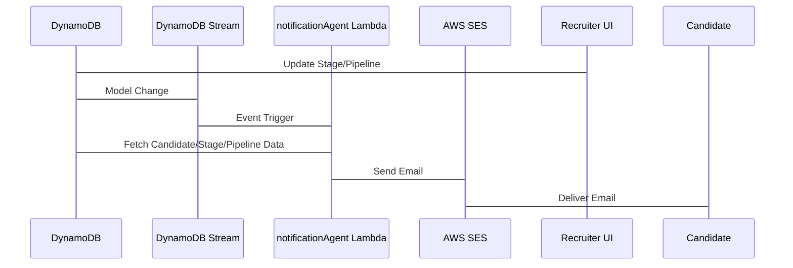

# Notification Engine Architecture

## Overview

This document outlines the architecture for the adaptive notification engine. The engine automates candidate communications (Success, Failure, Scheduling) triggered by stage transitions in the Pipe platform.

## Component Map

The notification engine consists of the following components:

1.  **DynamoDB Stream:**  Captures changes to the `Stage` and `Pipeline` models in DynamoDB.
2.  **notificationAgent Lambda Function:**  Processes events from the DynamoDB Stream.  It retrieves notification templates, substitutes variables, and sends emails via SES.
3.  **AWS SES (Simple Email Service):**  Delivers email notifications to candidates.
4.  **UI Configuration:** Allows recruiters to customize email templates and trigger mappings per-stage.



## Schema Updates

The following updates will be made to the `Stage` and `Pipeline` models in the Amplify Data schema:

**Stage Model:**

```typescript
type Stage @model {
  id: ID!
  name: String!
  pipeline: Pipeline @connection(fields: ["pipelineId"])
  pipelineId: ID!
  status: String
  notificationTemplates: [NotificationTemplate]
}

type NotificationTemplate {
  status: String!  # e.g., "PASSED", "FAILED", "SCHEDULING"
  subject: String!
  body: String!
}
```

**Pipeline Model:**

```typescript
type Pipeline @model {
  id: ID!
  name: String!
  stages: [Stage] @connection(keyName: "byPipeline", fields: ["id"])
  recruiterName: String
}
```

The `NotificationTemplate` type will store the email subject and body for each status.

## Multi-Provider Support for {{bookingUrl}} Generation

The `notificationAgent` will support multiple scheduling providers (e.g., Calendly, Cal.com) for generating the `{{bookingUrl}}` variable.

The system will be configurable to use a specific provider based on the recruiter's preferences or pipeline settings.

The `notificationAgent` will integrate with the provider's API to generate a unique booking URL for each candidate. This URL will be embedded in the email notification.

The integration with Calendly and Cal.com will require storing API keys and potentially OAuth tokens securely (e.g., using AWS Secrets Manager).
