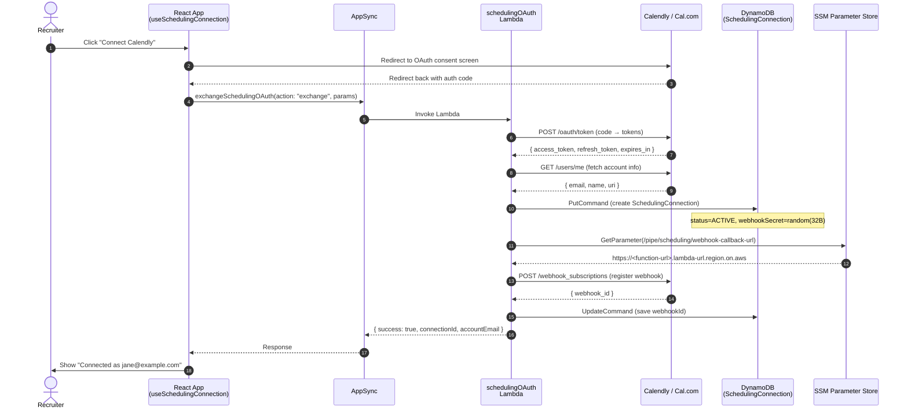
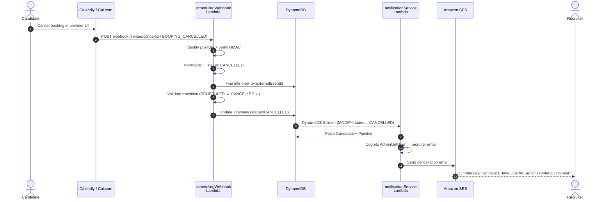
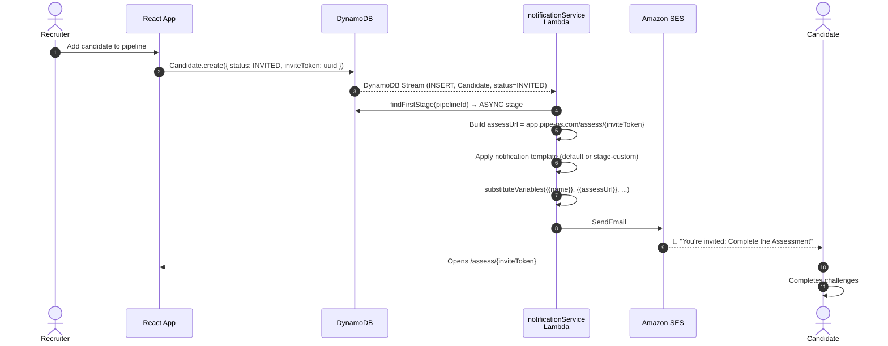
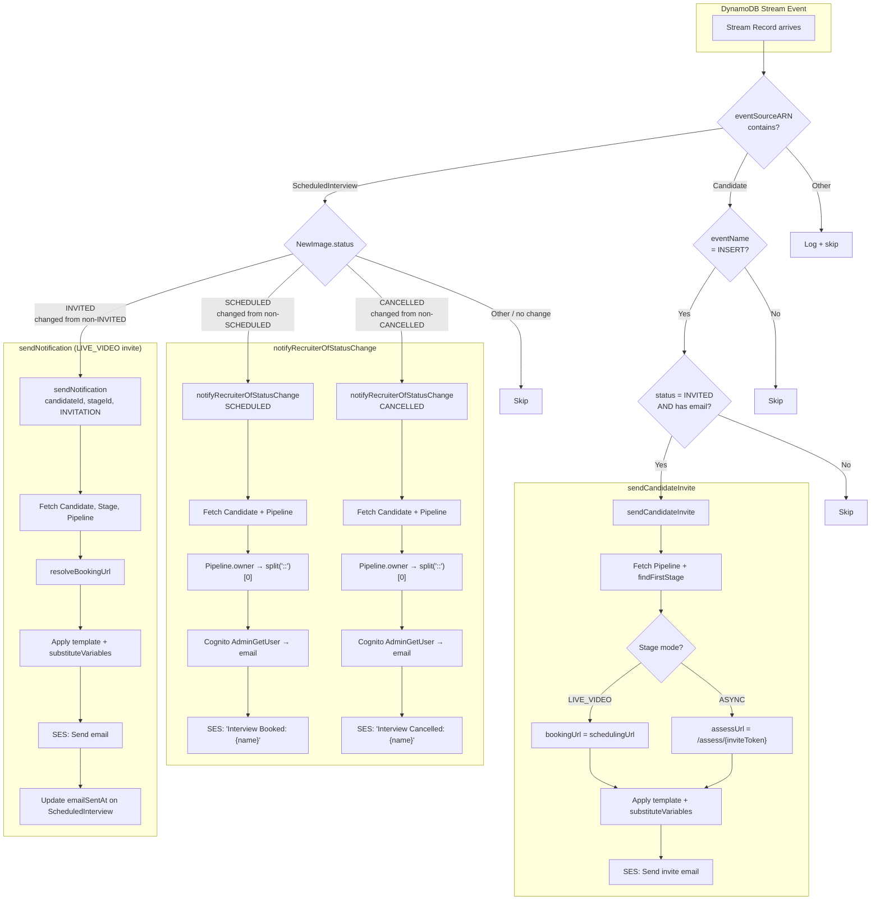

# Scheduling & Notification Flow — End-to-End Design

**Date:** 2026-03-03
**Status:** Implemented (Phase: Scheduling Plugin)
**Supersedes:** `notification-engine-architecture.md` (original pre-implementation spec)

---

## 1. System Overview

The scheduling and notification system connects three external services (Calendly, Cal.com, Amazon SES) to the Pipe platform through a set of Lambda functions, DynamoDB Streams, and a React frontend hook. The system handles:

1. **OAuth connection** — recruiter links their scheduling provider
2. **Webhook ingestion** — provider sends booking/cancellation events
3. **Interview state machine** — status transitions on `ScheduledInterview`
4. **Automated emails** — DynamoDB Streams trigger candidate invites and recruiter notifications

### Component Map

```
┌─────────────────────────────────────────────────────────────────────────────┐
│                           RECRUITER BROWSER                                 │
│                                                                             │
│  useSchedulingConnection()  ←──  AppSync subscription (observeQuery)        │
│      │                                                                      │
│      ├── exchangeOAuth()    →  AppSync Mutation → schedulingOAuth Lambda    │
│      ├── fetchEventTypes()  →  AppSync Mutation → schedulingOAuth Lambda    │
│      ├── disconnect()       →  AppSync Mutation → schedulingOAuth Lambda    │
│      └── registerWebhook()  →  AppSync Mutation → schedulingOAuth Lambda    │
└─────────────────────────────────────────────────────────────────────────────┘
                                        │
                                        ▼
┌─────────────────────────────────────────────────────────────────────────────┐
│                          AWS CLOUD INFRASTRUCTURE                           │
│                                                                             │
│  ┌──────────────────┐    ┌─────────────────┐    ┌──────────────────────┐   │
│  │ schedulingOAuth   │    │ schedulingWebhook│    │ notificationService  │   │
│  │ (AppSync Mutation)│    │ (Function URL)   │    │ (DynamoDB Stream)    │   │
│  └──────┬───────────┘    └──────┬──────────┘    └──────┬───────────────┘   │
│         │                       │                       │                   │
│         ▼                       ▼                       ▼                   │
│  ┌────────────┐         ┌────────────┐          ┌────────────┐             │
│  │ DynamoDB   │◄────────│ DynamoDB   │─ Stream ─▶│ Amazon SES │             │
│  │            │         │            │          │            │             │
│  │ • SchedulingConnection            │          │ • Candidate emails       │
│  │ • ScheduledInterview              │          │ • Recruiter emails       │
│  │ • Candidate                       │          └────────────┘             │
│  │ • Pipeline                        │                                     │
│  │ • Stage                           │          ┌────────────┐             │
│  └────────────┘                      │          │ Cognito    │             │
│                                      │          │ (recruiter │             │
│                                      │          │  email)    │             │
│                                      │          └────────────┘             │
│  ┌────────────┐                      │                                     │
│  │ SSM Param  │──webhook URL────────▶│                                     │
│  └────────────┘                      │                                     │
└─────────────────────────────────────────────────────────────────────────────┘
                                        ▲
                                        │
┌─────────────────────────────────────────────────────────────────────────────┐
│                       SCHEDULING PROVIDERS                                  │
│                                                                             │
│  ┌──────────┐   ┌──────────┐                                               │
│  │ Calendly │   │ Cal.com  │   ── POST webhook ──▶ schedulingWebhook       │
│  └──────────┘   └──────────┘                        (Lambda Function URL)   │
└─────────────────────────────────────────────────────────────────────────────┘
```

---

## 2. Data Model

### Core Entities

```
┌──────────────────────────┐       ┌──────────────────────────┐
│   SchedulingConnection   │       │    ScheduledInterview     │
├──────────────────────────┤       ├──────────────────────────┤
│ id                       │       │ id                       │
│ recruiterId              │       │ candidateId  ───────────▶│ Candidate
│ providerId (CALENDLY |   │       │ pipelineId  ────────────▶│ Pipeline
│             CAL_COM)     │       │ stageId  ───────────────▶│ Stage
│ accessToken              │       │ status (INVITED |        │
│ refreshToken             │       │         SCHEDULED |      │
│ tokenExpiry              │       │         COMPLETED |      │
│ accountEmail             │       │         CANCELLED |      │
│ accountName              │       │         NO_SHOW)         │
│ webhookSecret            │       │ scheduledAt              │
│ webhookId                │       │ meetingUrl               │
│ status (ACTIVE |         │       │ schedulingProvider       │
│         EXPIRED |        │       │ schedulingUrl            │
│         REVOKED)         │       │ externalEventId          │
│ connectedAt              │       │ syncSource (MANUAL |     │
│ lastSyncAt               │       │             WEBHOOK)     │
└──────────────────────────┘       │ lastSyncedAt             │
                                   │ emailSentAt              │
                                   └──────────────────────────┘
```

### ScheduledInterview State Machine

```
                    ┌──────────────────────────┐
                    │        INVITED            │
                    │  (recruiter created)      │
                    └──────┬──────────┬─────────┘
                           │          │
              candidate    │          │  candidate/recruiter
              books        │          │  cancels
                           ▼          ▼
                    ┌──────────┐  ┌──────────┐
                    │SCHEDULED │  │CANCELLED │
                    └──┬───┬───┘  └────┬─────┘
                       │   │           │
          session      │   │ no-show   │  re-invite
          completes    │   │           │
                       ▼   ▼           ▼
                ┌──────────┐  ┌──────────┐
                │COMPLETED │  │ NO_SHOW  │
                └──────────┘  └──┬───┬───┘
                                 │   │
                    re-schedule  │   │  cancel
                                 ▼   ▼
                          ┌──────────┐  ┌──────────┐
                          │SCHEDULED │  │CANCELLED │
                          └──────────┘  └──────────┘

Valid transitions:
  INVITED   → SCHEDULED, CANCELLED
  SCHEDULED → COMPLETED, CANCELLED, NO_SHOW
  COMPLETED → (terminal)
  CANCELLED → INVITED (re-invite)
  NO_SHOW   → SCHEDULED, CANCELLED
```

---

## 3. Flow A — OAuth Connection Setup

The recruiter connects their Calendly or Cal.com account from the pipeline settings page.



### Key Details

- **Token Storage:** `accessToken` and `refreshToken` are stored in DynamoDB. They never reach the client browser. All token operations happen server-side in the `schedulingOAuth` Lambda.
- **Webhook Secret:** A 32-byte random hex string is generated during connection setup and stored on both the `SchedulingConnection` (in DynamoDB) and registered with the provider. Used for HMAC verification of incoming webhooks.
- **SSM Parameter:** The webhook callback URL (Lambda Function URL) is stored in SSM at `/pipe/scheduling/webhook-callback-url` — not hardcoded in the Lambda.

---

## 4. Flow B — Candidate Invitation & Booking

This is the primary happy-path flow: a recruiter invites a candidate, the candidate books through the scheduling provider, and both parties receive email notifications.

```mermaid
sequenceDiagram
    autonumber
    actor R as Recruiter
    participant UI as React App
    participant AS as AppSync
    participant DB as DynamoDB
    participant NS as notificationService<br/>Lambda (Stream)
    participant SES as Amazon SES
    actor C as Candidate
    participant P as Calendly / Cal.com
    participant WH as schedulingWebhook<br/>Lambda (Function URL)

    rect rgb(40, 40, 60)
        Note over R,SES: Phase 1 — Recruiter Invites Candidate
        R->>UI: Add candidate (name, email)
        UI->>AS: Candidate.create({ status: INVITED })
        AS->>DB: Insert Candidate record
        DB-->>NS: DynamoDB Stream (INSERT, Candidate)
        NS->>DB: Fetch Stage, Pipeline
        NS->>SES: SendEmail (assessment link or booking link)
        SES-->>C: 📧 "You're invited: Senior Frontend Engineer"
    end

    rect rgb(40, 60, 40)
        Note over R,SES: Phase 1b — Recruiter Creates Interview Slot
        R->>UI: Click "Invite to Interview" on Kanban card
        UI->>AS: ScheduledInterview.create({ status: INVITED })
        AS->>DB: Insert ScheduledInterview
        DB-->>NS: DynamoDB Stream (INSERT, ScheduledInterview)
        NS->>DB: Fetch Candidate, Stage, Pipeline
        NS->>SES: SendEmail (booking link with scheduling URL)
        SES-->>C: 📧 "Book your interview: {{bookingUrl}}"
    end

    rect rgb(60, 40, 40)
        Note over C,WH: Phase 2 — Candidate Books via Provider
        C->>P: Opens booking link, selects time slot
        P->>P: Creates calendar event
        P->>WH: POST webhook (invitee.created / BOOKING_CREATED)
        Note over WH: 8-step processing pipeline
        WH->>WH: 1. Identify provider (headers)
        WH->>DB: 2. Find ACTIVE SchedulingConnection
        WH->>WH: 3. Verify HMAC signature
        WH->>WH: 4. Normalize payload → NormalizedSchedulingEvent
        WH->>DB: 5. Find ScheduledInterview (by externalEventId → email fallback)
        WH->>WH: 6. Validate transition (INVITED → SCHEDULED ✓)
        WH->>DB: 7. UpdateCommand (status=SCHEDULED, scheduledAt, meetingUrl, externalEventId)
        WH->>DB: 8. Update connection lastSyncAt
    end

    rect rgb(40, 50, 60)
        Note over DB,SES: Phase 3 — Recruiter Notification
        DB-->>NS: DynamoDB Stream (MODIFY, ScheduledInterview, status→SCHEDULED)
        NS->>DB: Fetch Candidate, Pipeline
        NS->>NS: Extract Pipeline.owner → split "sub::sub" → bare sub
        NS->>NS: Cognito AdminGetUser(sub) → recruiter email
        NS->>SES: SendEmail (recruiter notification)
        SES-->>R: 📧 "Interview Booked: Jane Doe for Senior Frontend Engineer"
    end
```



---

## 5. Flow C — Candidate Cancels Booking



---

## 6. Flow D — ASYNC Stage (No Scheduling)

For non-live stages (code review, quiz), a simpler path triggers on candidate creation:



---

## 7. Webhook Processing Pipeline (Detail)

The `schedulingWebhook` Lambda processes every incoming webhook through an 8-step pipeline:

```
┌─────────────────────────────────────────────────────────────────────────────┐
│                    schedulingWebhook — 8 Step Pipeline                       │
├─────────────────────────────────────────────────────────────────────────────┤
│                                                                             │
│  ┌────────────────────┐                                                     │
│  │ Step 1: Identify   │  headers → resolveNormalizer()                      │
│  │ Provider            │  • calendly-webhook-signature → Calendly            │
│  │                    │  • x-cal-signature-256 → Cal.com                    │
│  │                    │  • no match → 400 "Unknown provider"                │
│  └────────┬───────────┘                                                     │
│           ▼                                                                 │
│  ┌────────────────────┐                                                     │
│  │ Step 2: Find       │  DynamoDB Scan: SchedulingConnection                │
│  │ Connection          │  WHERE providerId=X AND status=ACTIVE              │
│  │                    │  • no match → 404 "No active connection"            │
│  └────────┬───────────┘                                                     │
│           ▼                                                                 │
│  ┌────────────────────┐                                                     │
│  │ Step 3: Verify     │  HMAC SHA-256 verification                          │
│  │ HMAC               │  Calendly: t=<ts>,v1=<sig> → HMAC(<ts>.<body>)      │
│  │                    │  Cal.com:  raw hex → HMAC(<body>)                   │
│  │                    │  No secret? → skip (log warning)                    │
│  │                    │  Failed? → 401 "Invalid webhook signature"          │
│  └────────┬───────────┘                                                     │
│           ▼                                                                 │
│  ┌────────────────────┐                                                     │
│  │ Step 4: Normalize  │  Provider payload → NormalizedSchedulingEvent        │
│  │ Payload             │  { externalEventId, status, candidateEmail,         │
│  │                    │    candidateName, scheduledAt, meetingUrl }          │
│  └────────┬───────────┘                                                     │
│           ▼                                                                 │
│  ┌────────────────────┐                                                     │
│  │ Step 5: Find       │  Two-phase lookup:                                  │
│  │ Interview           │  1. Scan by externalEventId (subsequent events)     │
│  │                    │  2. Fallback: email → Candidate → INVITED interview │
│  │                    │  • no match → 200 "No matching interview"           │
│  └────────┬───────────┘                                                     │
│           ▼                                                                 │
│  ┌────────────────────┐                                                     │
│  │ Step 6: Validate   │  canTransition(current, new)?                       │
│  │ Transition          │  • INVITED → SCHEDULED ✓                           │
│  │                    │  • COMPLETED → SCHEDULED ✗ (terminal)              │
│  │                    │  • invalid → 200 "Transition not allowed"           │
│  └────────┬───────────┘                                                     │
│           ▼                                                                 │
│  ┌────────────────────┐                                                     │
│  │ Step 7: Update     │  DynamoDB UpdateCommand:                            │
│  │ Interview           │  SET status, scheduledAt, syncSource=WEBHOOK,       │
│  │                    │      externalEventId, meetingUrl (if present)        │
│  └────────┬───────────┘                                                     │
│           ▼                                                                 │
│  ┌────────────────────┐                                                     │
│  │ Step 8: Update     │  DynamoDB UpdateCommand:                            │
│  │ Connection Sync     │  SET lastSyncAt, updatedAt                          │
│  └────────────────────┘                                                     │
│                                                                             │
│  → 200 { message: "Interview updated", event }                              │
└─────────────────────────────────────────────────────────────────────────────┘
```

### Interview Match Strategy (Step 5 Detail)

The two-phase lookup handles a critical timing issue: when a candidate books for the first time, the `ScheduledInterview` record has no `externalEventId` yet (it was created by the recruiter as `INVITED`). The webhook is the first time we learn the provider's event ID.

```
                 Webhook arrives with:
                 { externalEventId: "calendly://evt_abc", candidateEmail: "jane@example.com" }
                                    │
                                    ▼
                    ┌───────────────────────────────┐
                    │ Phase 1: Scan by               │
                    │ externalEventId                │
                    │ (ScheduledInterview table)     │
                    └───────────┬───────────────────┘
                                │
                        Found?  │
                     ┌──────────┴──────────┐
                     │ YES                 │ NO
                     ▼                     ▼
              Return interview      ┌───────────────────────────┐
                                    │ Phase 2: Email fallback    │
                                    │                           │
                                    │ 1. Scan Candidate table   │
                                    │    WHERE email = X         │
                                    │                           │
                                    │ 2. For each candidate:    │
                                    │    Scan ScheduledInterview │
                                    │    WHERE candidateId = Y   │
                                    │    AND status = INVITED    │
                                    │                           │
                                    │ 3. Return first match     │
                                    └───────────────────────────┘
```

> **Why no `Limit: 1` on the email fallback scans?** A `FilterExpression` is applied _after_ the scan reads items. With `Limit: 1`, DynamoDB reads one item, then filters — if that one item doesn't match, it returns 0 results even though matches exist deeper in the table. We intentionally omit `Limit` to ensure all matches are found.

---

## 8. Notification Service — Stream Processing Swimlane



---

## 9. Notification Templates & Variable Substitution

### Template Resolution Chain

```
Stage.notificationTemplates (JSON array)     ← recruiter-customized, highest priority
        │
        ▼ not found for trigger type?
Default template (hardcoded)                  ← getDefaultTemplate() / getDefaultCandidateTemplate()
```

### Available Variables

| Variable | Source | Example |
|----------|--------|---------|
| `{{name}}` / `{{candidateName}}` | `Candidate.name` | `Jane Doe` |
| `{{stageName}}` | `Stage.title` | `Technical Interview` |
| `{{pipelineName}}` | `Pipeline.title` | `Senior Frontend Engineer` |
| `{{bookingUrl}}` | Resolved dynamically (see below) | `https://calendly.com/...?name=Jane&email=jane@...` |
| `{{assessUrl}}` | `APP_URL/assess/{inviteToken}` | `https://app.pipe-os.com/assess/abc-123` |
| `{{recruiterName}}` | `Pipeline.recruiterName` | `Sarah` |
| `{{companyName}}` | Hardcoded | `Pipe OS` |

### Booking URL Resolution

```
resolveBookingUrl(candidate, stage, pipeline, interviewId?)
    │
    ├── LIVE_VIDEO + interviewId?
    │       │
    │       ├── ScheduledInterview.schedulingUrl exists?
    │       │       → {schedulingUrl}?name=...&email=...
    │       │
    │       └── Pipeline.schedulingUrl exists?
    │               → {pipeline.schedulingUrl}?name=...&email=...
    │
    ├── ASYNC + candidate.inviteToken?
    │       → APP_URL/assess/{inviteToken}
    │
    └── fallback
            → APP_URL
```

---

## 10. Email Types Summary

| Trigger | Recipient | Subject Pattern | Triggered By |
|---------|-----------|----------------|--------------|
| **Candidate Invite (ASYNC)** | Candidate | "You're invited: {{pipelineName}} Assessment" | `Candidate` INSERT (DynamoDB Stream) |
| **Candidate Invite (LIVE_VIDEO)** | Candidate | "Interview Invitation: {{pipelineName}}" | `ScheduledInterview` status → INVITED (DynamoDB Stream) |
| **Interview Booked** | Recruiter | "Interview Booked: {{candidateName}} for {{pipelineName}}" | `ScheduledInterview` status → SCHEDULED (DynamoDB Stream, set by webhook) |
| **Interview Cancelled** | Recruiter | "Interview Cancelled: {{candidateName}} for {{pipelineName}}" | `ScheduledInterview` status → CANCELLED (DynamoDB Stream, set by webhook) |
| **Manual notification** | Candidate | Template-based (SUCCESS / FAILURE / INVITATION) | AppSync `sendNotification` mutation |

---

## 11. Provider Normalization

Each scheduling provider has a different webhook payload format. The normalizer layer abstracts this into a common `NormalizedSchedulingEvent`:

```typescript
interface NormalizedSchedulingEvent {
  externalEventId: string;
  status: 'SCHEDULED' | 'CANCELLED' | 'COMPLETED';
  candidateEmail: string;
  candidateName?: string;
  scheduledAt: string;
  meetingUrl?: string;
}
```

### Calendly

| Provider Field | Normalized Field | Notes |
|----------------|------------------|-------|
| `event` = `invitee.created` | `status` = `SCHEDULED` | |
| `event` = `invitee.canceled` | `status` = `CANCELLED` | |
| `payload.email` → `payload.invitee.email` → `payload.scheduled_event.invitees[0].email` | `candidateEmail` | 3-level fallback chain |
| `payload.scheduled_event.uri` | `externalEventId` | Calendly event URI |
| `payload.scheduled_event.start_time` | `scheduledAt` | ISO 8601 |
| `payload.scheduled_event.location.join_url` | `meetingUrl` | Zoom/Meet link |

**HMAC Format:** `t=<timestamp>,v1=<hex_signature>` — HMAC computed over `<timestamp>.<body>`

### Cal.com

| Provider Field | Normalized Field | Notes |
|----------------|------------------|-------|
| `triggerEvent` = `BOOKING_CREATED` | `status` = `SCHEDULED` | |
| `triggerEvent` = `BOOKING_CANCELLED` | `status` = `CANCELLED` | |
| `triggerEvent` = `MEETING_ENDED` | `status` = `COMPLETED` | |
| `payload.attendees[0].email` | `candidateEmail` | |
| `payload.bookingId` (fallback: `payload.id`) | `externalEventId` | |
| `payload.startTime` | `scheduledAt` | |
| `payload.metadata.videoCallUrl` | `meetingUrl` | |

**HMAC Format:** Raw hex SHA-256 — HMAC computed over body only

---

## 12. Recruiter Email Resolution

Recruiter notifications require resolving the pipeline owner's email. Amplify stores owners in `sub::sub` format (Cognito subject duplicated with `::` separator).

```
Pipeline.owner = "a1b2c3d4-e5f6-7890-abcd-ef1234567890::a1b2c3d4-e5f6-7890-abcd-ef1234567890"
                  ▲                                        ▲
                  └── bare Cognito sub (use this)          └── duplicated (ignore)

                              │
                              ▼
              Cognito AdminGetUser(Username: bare_sub)
                              │
                              ▼
              UserAttributes → find(Name === 'email')
                              │
                              ▼
                  recruiterEmail = "sarah@company.com"
```

---

## 13. Failure Modes & Error Handling

| Failure | Behavior | Recovery |
|---------|----------|----------|
| Unknown webhook provider | 400 response to provider | Provider retries (exponential backoff) |
| No ACTIVE connection | 404 response | Recruiter must reconnect OAuth |
| HMAC verification fails | 401 response | Check webhook secret rotation |
| No matching interview | 200 response (non-error) | Expected for non-Pipe bookings on same calendar |
| Invalid status transition | 200 response (non-error) | Idempotent — duplicate webhooks are safe |
| DynamoDB error | 500 response | Provider retries; Lambda CloudWatch alarm |
| SES send failure (candidate) | Error thrown, retry via Stream DLQ | Check SES sandbox/quota |
| SES send failure (recruiter) | Error caught, logged, **not retried** | Best-effort; check CloudWatch |
| Cognito lookup failure | Logged, no email sent | Check USER_POOL_ID env var |
| Token expired during webhook | N/A (webhook doesn't use tokens) | Token refresh is separate (OAuth Lambda) |
| Webhook disabled (rollback) | 503 response | Set `WEBHOOK_ENABLED=true` to re-enable |

---

## 14. Environment Variables

### schedulingWebhook

| Variable | Source | Description |
|----------|--------|-------------|
| `SCHEDULINGCONNECTION_TABLE_NAME` | Amplify (auto) | DynamoDB table for connections |
| `SCHEDULEDINTERVIEW_TABLE_NAME` | Amplify (auto) | DynamoDB table for interviews |
| `CANDIDATE_TABLE_NAME` | Amplify (auto) | DynamoDB table for candidates |
| `WEBHOOK_ENABLED` | Manual | Rollback switch — set `false` to disable |

### notificationService

| Variable | Source | Description |
|----------|--------|-------------|
| `CANDIDATE_TABLE_NAME` | Amplify (auto) | |
| `STAGE_TABLE_NAME` | Amplify (auto) | |
| `PIPELINE_TABLE_NAME` | Amplify (auto) | |
| `SCHEDULEDINTERVIEW_TABLE_NAME` | Amplify (auto) | |
| `SES_SENDER_EMAIL` | Amplify sandbox secret | Verified SES sender address |
| `USER_POOL_ID` | Amplify (auto) | Cognito User Pool for recruiter email lookup |
| `APP_URL` | Manual | Base URL for candidate-facing links |

### schedulingOAuth

| Variable | Source | Description |
|----------|--------|-------------|
| `SCHEDULINGCONNECTION_TABLE_NAME` | Amplify (auto) | |
| `CALENDLY_CLIENT_ID` | Amplify sandbox secret | |
| `CALENDLY_CLIENT_SECRET` | Amplify sandbox secret | |
| `CALCOM_CLIENT_ID` | Amplify sandbox secret | |
| `CALCOM_CLIENT_SECRET` | Amplify sandbox secret | |
| `WEBHOOK_URL_SSM_PARAM` | Manual | SSM path for webhook callback URL |

---

## 15. Security Considerations

1. **HMAC Verification:** Every webhook is verified using `timingSafeEqual` to prevent timing attacks. The webhook secret is generated per-connection (not shared globally).

2. **Token Isolation:** OAuth tokens (`accessToken`, `refreshToken`) never leave the Lambda runtime. The React hook calls AppSync mutations; the Lambda uses tokens server-side.

3. **DynamoDB Encryption:** All tables use SSE (server-side encryption) at rest by default.

4. **Owner Verification:** `handleRegisterWebhook` checks that the requesting recruiter matches the `recruiterId` on the connection before allowing webhook re-registration.

5. **Rollback Switch:** `WEBHOOK_ENABLED=false` immediately disables all webhook processing (returns 503) for incident response.
