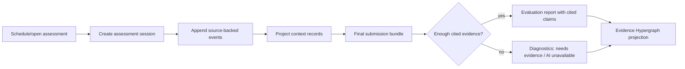

# Repo-Task Assessment Session Spine

Date: 2026-06-27
Owner: Agent B, Assessment Layer Event Spine

## Purpose

This is the backend assessment substrate underneath repo-task interviews.
`OPEN_SOURCE_BUG_FIX`, `DEV_CONTAINER_REPO_TASK`, `CODE_REVIEW`, standard video
interviews, dev-container work, chat, transcript segments, and AI agent bridge
interactions all become assessment sessions that append source-backed evidence.

The layer stores what happened. It does not invent match quality, seniority, AI
developer behavior, or score claims. Evaluations can only make positive claims
when the claim cites exact source evidence.

## Hiring Manager Flow

1. A hiring manager selects an assessment surface, such as `OPEN_SOURCE_BUG_FIX`
   or later `DEV_CONTAINER_REPO_TASK`.
2. The runtime creates or resolves an assessment session linked to the scheduled
   interview, candidate, workspace, and optional workspace-person/application.
3. As the candidate works, each meaningful artifact is appended as an immutable
   event: plan, diagram, chat message, transcript span, terminal output, test
   run, code diff, AI/tool interaction, recruiter note, or final submission.
4. Each event carries source refs with exact text and content hashes. The event
   is also projected into `context_records` with `scope_type =
   assessment_session`, so the Evidence Hypergraph can rebuild edges later.
5. The state machine advances from `INTAKE` to `IN_PROGRESS`,
   `FINAL_SUBMITTED`, `EVALUATING`, and either `EVALUATED` or `DIAGNOSTIC`.
6. The evaluator writes a final report. Positive claims require exact source
   refs; missing evidence or unavailable AI produces diagnostics instead.
7. The hiring manager reads the assessment report as a cited dossier, not a
   black-box score. Unsupported positives are absent and replaced by explicit
   diagnostic gaps.

## Backend Contract

Canonical storage is `assessment_sessions` plus immutable evidence, report,
claim, source-ref, and diagnostic tables from
`workers/api/migrations/0102_assessment_layer.sql`.

Repo-task callers use the facade in
`workers/api/src/lib/repoTaskInterviewSession.ts` and the route in
`workers/api/src/routes/assessment/repoTaskSessions.ts`.

API shape:

- `POST /sessions`: create an assessment session for a supported mode.
- `POST /sessions/:sessionId/events`: append a source-backed event.
- `POST /sessions/:sessionId/state`: record a state transition.
- `POST /sessions/:sessionId/final-submission-bundles`: append the candidate's
  final assessment bundle, storing each included plan/diagram/message/terminal
  output/test run/code diff/AI interaction/tool use/transcript artifact as its
  own source-backed event before recording the final submission event and moving
  the session to `FINAL_SUBMITTED`.
- `POST /sessions/:sessionId/evaluation-reports`: persist final output,
  cited claims, and diagnostics.
- `POST /sessions/:sessionId/diagnostics/ai-provider-unavailable`: record a
  real `AI_DEVELOPER_UNAVAILABLE` diagnostic.

The route is intentionally not mounted into global runtime routing in this
slice; Agent A owns runtime/routing integration.

CODE_REVIEW scoring now has a server-side projection helper:
`ingestCodeReviewAssessmentEvidence` records the final review transcript, score
report, state transitions, and evaluation report into the same assessment
tables when the scorer runs. The helper is idempotent and no-ops when the
assessment schema is absent, preserving older test fixtures and migrations.

## Evidence Invariants

- Events require at least one source ref with exact text and content hash.
- Positive evaluation claims require at least one exact source ref that already
  exists on an immutable assessment event in the same session.
- Evaluation reports store final output JSON but do not treat it as evidence for
  positive claims unless underlying claim refs cite source artifacts.
- Diagnostics can exist without source refs when the gap is missing evidence or
  unavailable AI.
- Events, source refs, evaluation reports, claims, and diagnostics are immutable.
- Context-record projection uses the assessment session as scope; graph concepts
  and conclusions remain rebuildable projections, not hard-coded tables.

## Runtime Handoff

Agent A/runtime surfaces should submit evidence in this order:

1. Create session after resolving the scheduled interview/candidate server-side.
2. Append candidate/recruiter/runtime events as they happen.
3. Submit the final bundle when the candidate is done. The backend records all
   included artifact events before marking `FINAL_SUBMITTED`.
4. If a real AI provider cannot respond, call the AI-unavailable diagnostic
   path. Do not simulate Devin, an agent, or a PR author.
5. Evaluation workers consume the session evidence and write either a cited
   report or diagnostics.

For CODE_REVIEW, `scoreAndPropagate` is the first integrated worker path. It
continues writing living-context review score records, then mirrors the scored
transcript/report into the assessment evidence spine with exact source refs.

Candidate-facing clients should keep receiving invite/session tokens only.
Internal session ids stay server-side until a Worker has resolved ownership.

As of 2026-07-01, the candidate dev-container panel resolves assessment
progress through `/rpc/assessment/progress` and can finalize the real workspace
`HEAD` through `/rpc/dev-container/:sessionId/assessment/finalize`. That route
resolves the candidate-owned dev-container session and latest open assessment
server-side, asks the container bridge to return source-backed commit/diff/test
evidence without posting it directly, then persists the commit through the
repo-task `submitCommit` invariants and returns candidate-safe progress. The
manual `/rpc/assessment/commit-submission` path remains a fallback for cases
where a live workspace bridge cannot produce evidence.
