# Role Discovery Interview Flow — Diagrams

---

## 1. Current Production Architecture

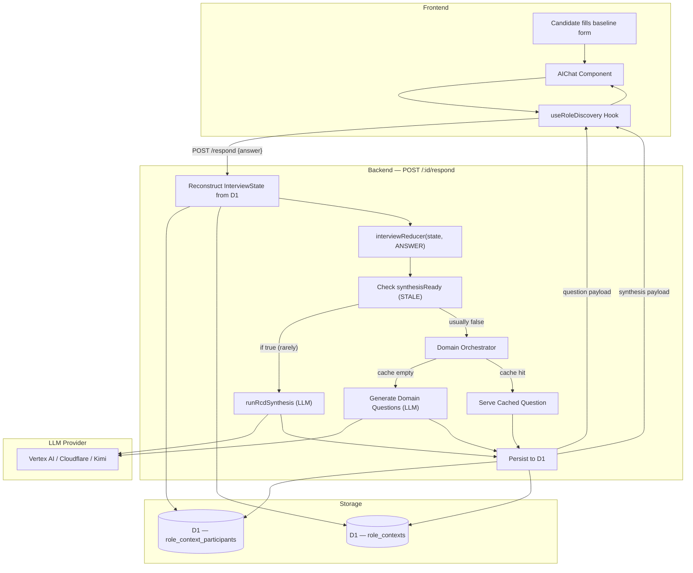

---

## 2. Complete Interview Lifecycle — From Start to Finish

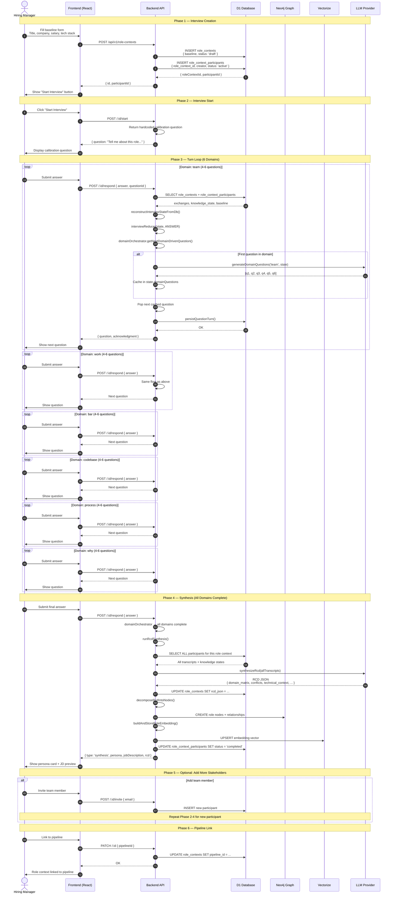

---

## 3. The /respond Turn Loop (Sequence Diagram)

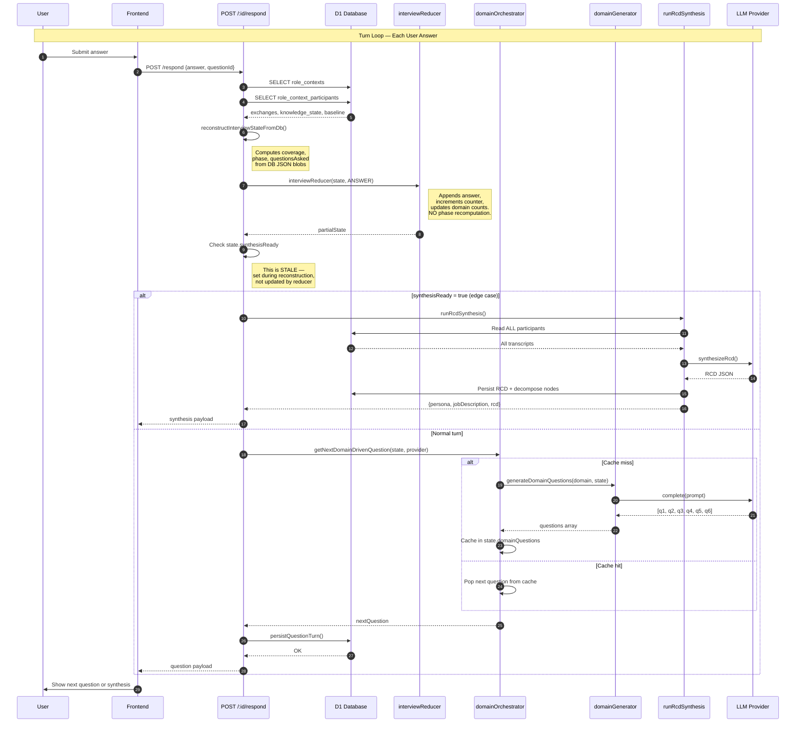

---

## 4. Domain Orchestrator — The Real State Machine

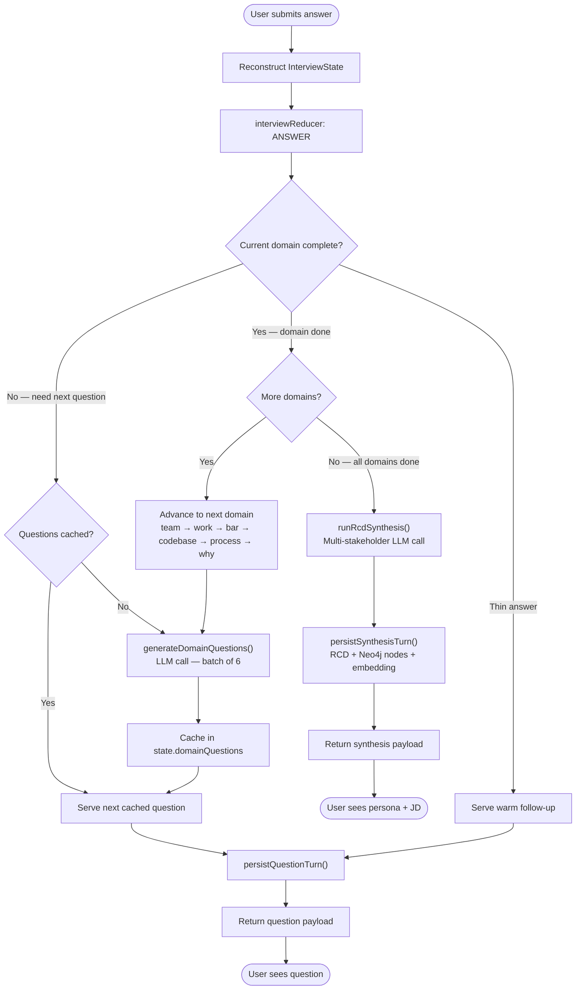

---

## 5. State Reconstruction from Database

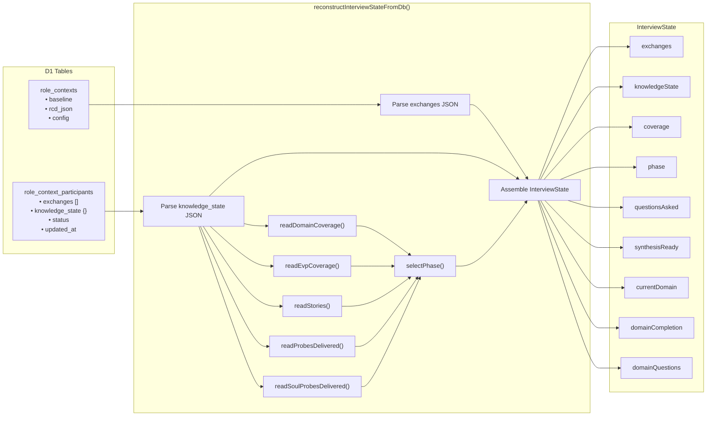

---

## 6. UAR — Complete Interview Lifecycle (Proposed, Never Implemented)

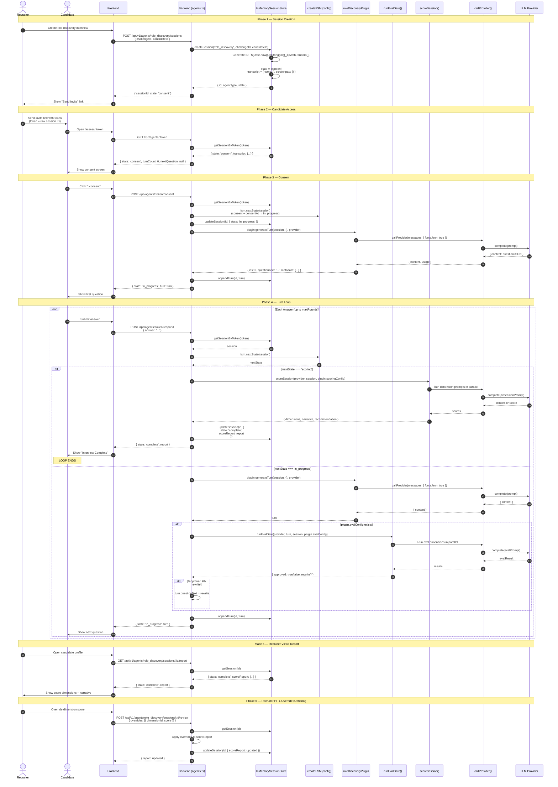

### Key Differences from Current Production

| Aspect | UAR (Proposed) | Current Production |
|--------|---------------|-------------------|
| **Session storage** | `InMemorySessionStore` (resets on deploy) | D1 `role_context_participants` |
| **Candidate auth** | Raw session ID in URL (no JWT) | Clerk JWT for recruiters, candidate JWT for assessments |
| **State ownership** | Backend holds `AgentSession` | Frontend sends `clientState`, backend reconstructs from D1 |
| **Phase transitions** | Generic FSM: `consent → in_progress → scoring → complete` | Domain orchestrator: `team → work → bar → codebase → process → why` |
| **Turn generation** | `plugin.generateTurn()` — one question at a time | `domainGenerator` — batch of 4-6 questions per domain |
| **Eval gate** | Per-turn `runEvalGate()` before delivery | **Disabled** in production |
| **Synthesis trigger** | FSM hits `scoring` state | `domainOrchestrator` signals all domains complete |
| **Scoring** | `scoreSession()` with dimension config | `runRcdSynthesis()` — multi-stakeholder RCD |
| **LLM calls per domain** | 1 per question (no batching) | 1 per domain batch (4-6 questions) |
| **Report** | `GET /api/v1/agents/:type/sessions/:id/report` | Embedded in synthesis response |

### Why It Failed

1. **Session ID as token** — No auth. Anyone guessing the ID can access the interview.
2. **In-memory store** — Sessions vanish on every deploy/restart.
3. **Generic FSM** — `consent → in_progress → scoring → complete` doesn't model role discovery. Role discovery has no "scoring" phase — it produces an RCD, not a candidate score.
4. **Plugin stubs** — All three plugins (`roleDiscovery`, `codeReview`, `culture`) were stubs returning mock data.
5. **No batching** — One LLM call per question vs. one LLM call per domain (4-6 questions).
6. **No multi-stakeholder support** — `AgentSession` has one `candidateId`. Role discovery interviews multiple stakeholders.

---

## 7. The Three Architectures Compared

### 5a. UAR — Proposed, Never Adopted (April 24)

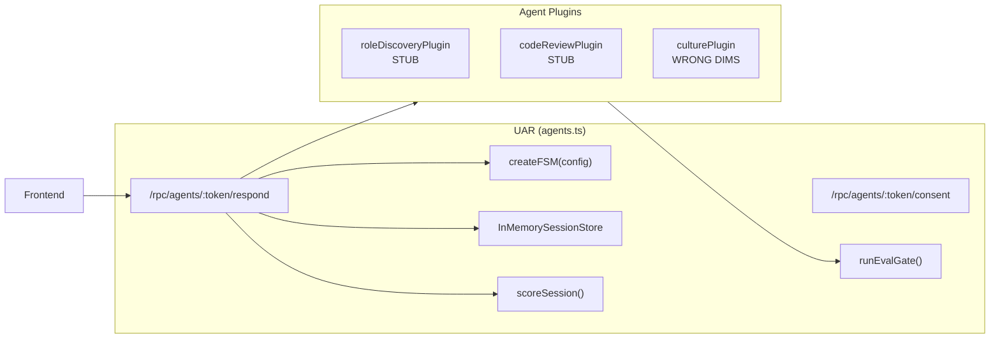

**Status:** ❌ Dead code. No auth. In-memory store resets on deploy. All plugins are stubs.

---

### 5b. Split-Endpoint State Machine — Built, Abandoned (April 28)

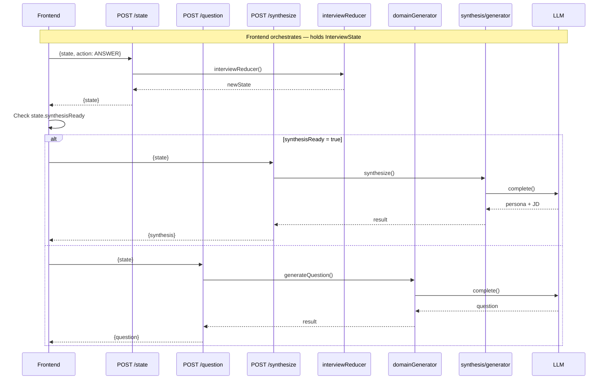

**Status:** ❌ Endpoints return 410 Gone. Frontend never cut over.

---

### 5c. Current Production — Monolithic /respond (Today)

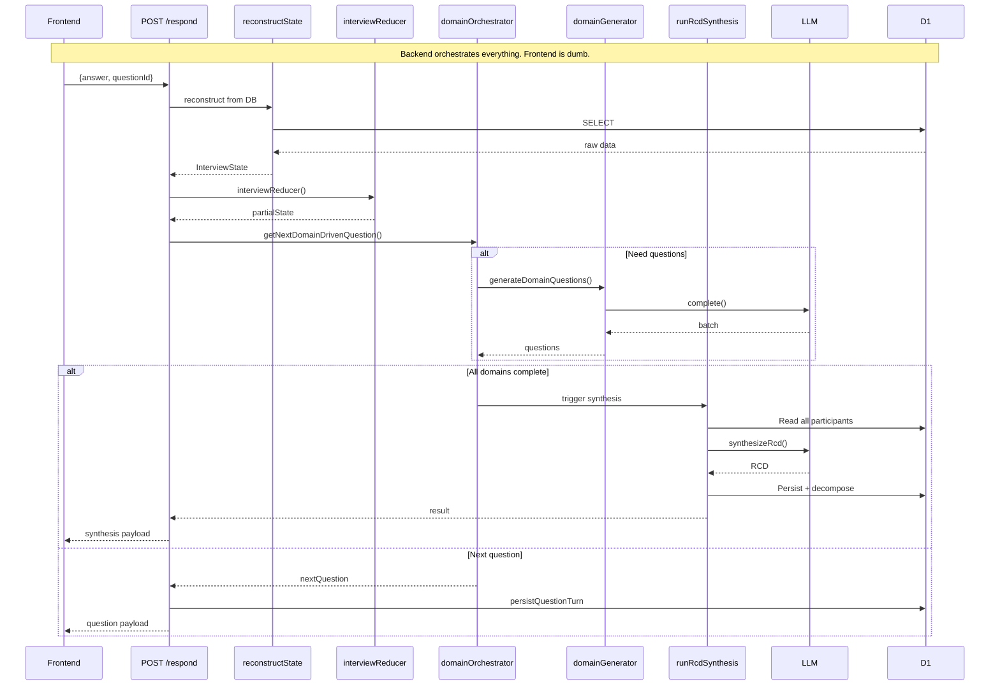

**Status:** ✅ This is what actually runs. The frontend calls one endpoint. The backend decides everything.

---

## 8. Data Flow — What Happens to InterviewState

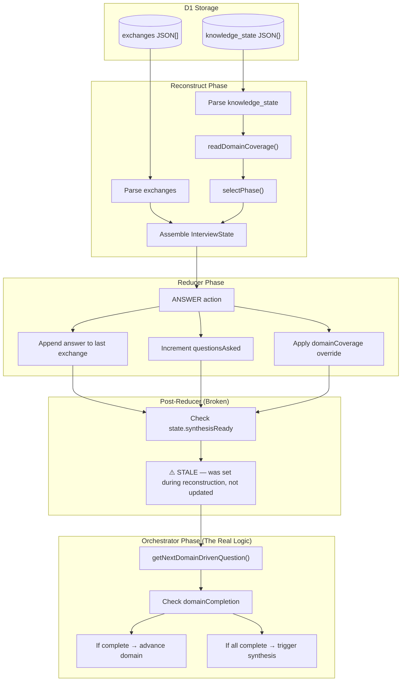

---

## 9. Provider Chain & Fallback

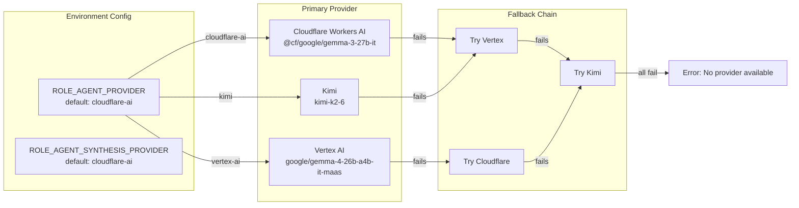

---

## 10. Synthesis Flow (When Interview Completes)

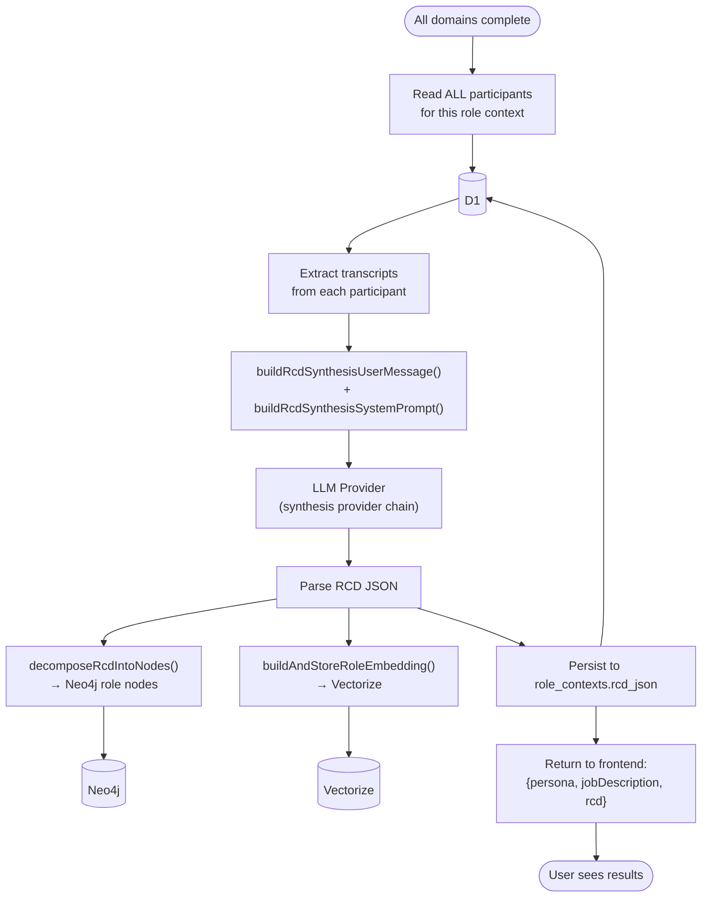

---

## 11. The Broken Part — Visualized

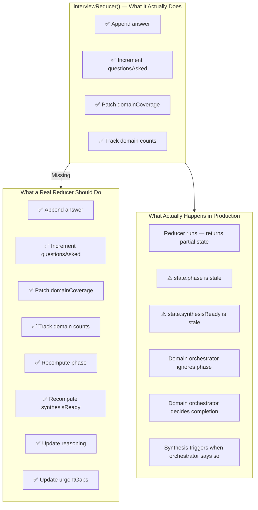

---

## 12. Clean Architecture (What It Should Look Like)

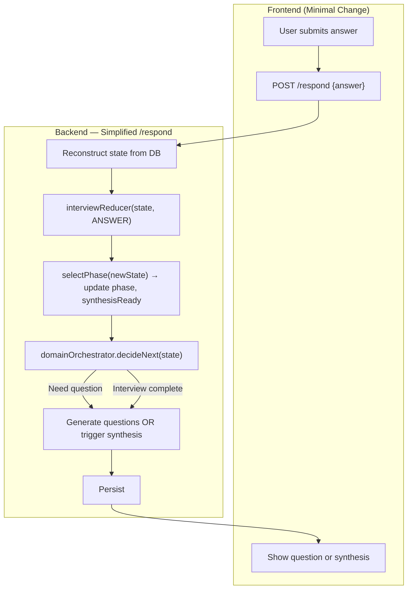

**Changes needed:**
1. Call `selectPhase()` inside or immediately after `interviewReducer()`
2. Remove the stale `state.synthesisReady` check in `/respond`
3. Trust `domainOrchestrator` to signal completion
4. Delete dead code (UAR, 410 endpoints, unused generator/eval/reflector)
