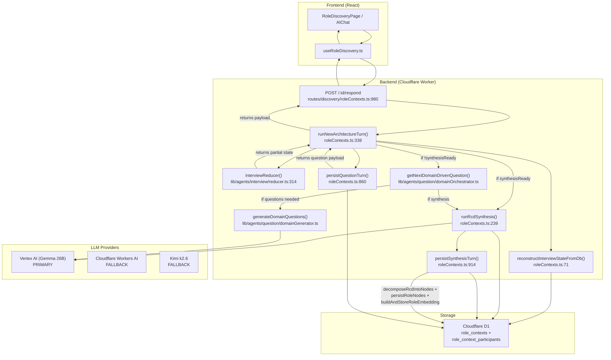

# Role Discovery Interview Flow — Current Production (May 2026)

**Status:** This document describes what actually runs in production today. It supersedes ADR-034 (UAR) and the April 28 state-machine handoff, both of which describe dead or abandoned code paths.

**Last updated:** 2026-05-18

---

## 1. The Big Picture

The role discovery interview has **one entry point** that the frontend calls:

```
POST /api/v1/role-contexts/:id/respond
```

Everything happens inside this endpoint. The frontend sends an answer. The backend decides what to do next (ask another question or produce a synthesis) and returns the result. The frontend holds almost no state.

This is a **monolithic endpoint** — not the split `/state` + `/question` + `/synthesize` architecture that was built in April and abandoned.

---

## 2. Full Flow Diagram



---

## 3. Step-by-Step Execution

### Step 0: Interview Creation

```
POST /api/v1/role-contexts
```

- Creates a `role_contexts` row with baseline data (title, company, salary, tech stack)
- Creates a `role_context_participants` row for the creator
- Returns `{ id, participantId }`

### Step 1: Start / Calibration

```
POST /api/v1/role-contexts/:id/start
```

- Returns a hardcoded calibration question (always the same)
- No LLM call

### Step 2: Turn Loop — The Main Path

```
POST /api/v1/role-contexts/:id/respond
Body: { answer, questionId, clientState? }
```

#### 2a. Reconstruct state from database

`reconstructInterviewStateFromDb()` reads:
- `role_context_participants.exchanges` (JSON array)
- `role_context_participants.knowledge_state` (JSON blob)
- `role_contexts.baseline` (JSON)
- Computes `coverage`, `phase`, `questionsAsked`, etc. from these

If `clientState` is provided, uses that instead (for frontend optimistic updates).

#### 2b. Run the reducer

```ts
state = interviewReducer(state, { type: 'ANSWER', answer })
```

What the reducer does:
- Appends the answer to the last exchange
- Increments `questionsAsked`
- Applies optional `domainCoverage` override (if provided by caller)
- Tracks per-domain question counts

What the reducer does **NOT** do:
- ❌ Recompute `phase`
- ❌ Recompute `synthesisReady`
- ❌ Recompute `reasoning` or `urgentGaps`
- ❌ Make any LLM calls

#### 2c. Check synthesis readiness

```ts
if (state.synthesisReady) {
  // Run synthesis
} else {
  // Ask next question
}
```

**IMPORTANT:** `state.synthesisReady` is stale here. It was computed during state reconstruction, not updated by the reducer. In practice, this check is bypassed because the domain orchestrator (Step 2d) is what actually decides when the interview is done.

#### 2d. Domain orchestrator — the REAL state machine

```ts
const { getNextDomainDrivenQuestion } = await import('../../lib/agents/question/domainOrchestrator')
const result = await getNextDomainDrivenQuestion(state, provider)
```

The domain orchestrator implements a **column-by-column flow**:

```
team → work → bar → codebase → process → why
```

For each domain:
1. **Generate** 4-6 questions via `domainGenerator.ts` (one LLM call)
2. **Ask** them one by one (no LLM call — serves from cache)
3. **Evaluate** the answer (thin? thick?)
4. If thin → ask 1-2 warm follow-ups
5. If thick → mark domain complete, advance to next domain
6. If all domains complete → trigger synthesis

The `phase` field (`CONTEXT` → `DISCOVERY` → `SOUL` → `PRIORITIZE` → `EVP_FRICTION` → `WRAP_UP`) is **not used** by the orchestrator. It exists for backwards compatibility and UI display only.

#### 2e. Question generation (when cache is empty)

```ts
generateDomainQuestions(domain, state, provider)
```

- Builds a prompt from `InterviewState`
- Calls `provider.complete()` with `forceJson: true`
- Parses JSON array of `GeneratedQuestion` objects
- Each question has: `id`, `text`, `intent`, `drillingHints`, `ladderingTarget`

**Provider chain:**
1. Primary: `createRoleAgentProvider()` → resolves `ROLE_AGENT_PROVIDER` env var (default: `cloudflare-ai`)
2. Fallback: `createRoleAgentFallbackProvider()` → tries a different backend

**Current provider priority:**
- If `ROLE_AGENT_PROVIDER=vertex-ai` → Vertex AI Gemma 26B → fallback to Cloudflare AI → fallback to Kimi
- If `ROLE_AGENT_PROVIDER=cloudflare-ai` → Cloudflare Workers AI → fallback to Vertex AI → fallback to Kimi

#### 2f. Synthesis (when interview is complete)

```ts
runRcdSynthesis(participantId)
```

This is the **multi-stakeholder** synthesis path:
1. Reads ALL participants for this role context from D1
2. Calls `synthesizeRcd()` with all transcripts
3. LLM produces: `domain_matrix`, `conflicts`, `technical_context`, `team_culture_profile`, `consumer_slice`
4. Persists RCD to `role_contexts.rcd_json`
5. Decomposes RCD into Neo4j role nodes
6. Builds and stores role embedding

**Provider:** `createRoleAgentSynthesisProvider()` → separate provider chain from question generation.

#### 2g. Persistence

**Question turn:**
```ts
persistQuestionTurn(state, question, participantId)
```
- Updates `role_context_participants.exchanges` (appends question)
- Updates `role_context_participants.knowledge_state`
- Updates `role_context_participants.updated_at`

**Synthesis turn:**
```ts
persistSynthesisTurn(state, synthesis, participantId)
```
- Marks participant as `status = 'completed'`
- Stores RCD in `role_contexts.rcd_json`
- Triggers async decomposition + embedding

#### 2h. Response to frontend

**Question response:**
```json
{
  "type": "question",
  "question": { "id": "q-3", "text": "...", "intent": "..." },
  "acknowledgment": "Thanks for sharing...",
  "state": { "phase": "DISCOVERY", "coverage": {...}, "questionsAsked": 3 }
}
```

**Synthesis response:**
```json
{
  "type": "synthesis",
  "persona": {...},
  "jobDescription": "# Senior Full Stack Engineer...",
  "rcd": {...}
}
```

---

## 4. What Problem Was the State Machine Trying to Solve?

### The Original Problem (before April 2026)

`callRoleAgent` (677 lines, now deleted) was a monolithic function that:
- Generated the question
- Checked if synthesis was ready
- Ran tool calls (company research, tech search)
- Merged knowledge state
- All in **one opaque async function**

**Latency:** 3-5 seconds per turn. The frontend showed a "thinking..." spinner with no visibility into what was happening.

### The Proposed Solution (April 28 state machine)

Split into three explicit steps:
1. **`/state`** — run deterministic reducer (<10ms, no LLM)
2. **`/question`** — generate one question (one LLM call, ~2s)
3. **`/synthesize`** — produce RCD (one LLM call, ~3s)

**Benefits:**
- Frontend sees exact state after every action
- No hidden work
- Latency per turn: ~2s (single LLM call vs. multiple serial calls)
- Deterministic phase transitions visible in UI

### What Actually Happened

The backend was rebuilt but the **frontend was never cut over**. The `/respond` endpoint was modified to use the new backend code (`interviewReducer` + `domainOrchestrator`) but kept as a monolithic endpoint.

So today:
- ✅ Backend uses the new deterministic reducer
- ✅ Backend uses the new domain orchestrator
- ✅ Single LLM call per turn (domain generator)
- ❌ Frontend still calls one endpoint (`/respond`)
- ❌ Frontend does not display phase, coverage, or progress
- ❌ The `/state`, `/question`, `/synthesize` endpoints return 410 Gone

**Result:** We got the latency improvement but not the UI transparency.

---

## 5. Why Was the UAR Created?

ADR-034 (April 24) proposed a **Unified Agent Runtime** to share code across three agents:

| Agent | FSM | Eval Gate | Scoring | Session Store |
|---|---|---|---|---|
| Role Discovery | ✅ | ✅ (5 dims) | ❌ (interviewer only) | `role_context_participants` |
| Code Review | ✅ | ✅ (consistency) | ✅ (6 dims) | `review_sessions` |
| Culture Interview | ✅ | ✅ (3 dims) | ✅ (10 dims) | Planned `culture_sessions` |

**The goal:** One shared FSM, one shared eval gate, one shared scorer, one shared session table.

**Why it failed:**
1. The plugin interface was too generic. Real agents have divergent needs:
   - Role discovery has **no scoring** (produces RCD, not candidate score)
   - Code review has **multi-turn annotation threads** (not one question + one answer)
   - Culture interview has **STAR-slot detection** (not simple Q&A)
2. The UAR eval gate depended on UAR types (`AgentSession`, `AgentTurn`). The team built a standalone eval gate instead.
3. The UAR session store (`InMemorySessionStore`) reset on deploy. The `D1SessionStore` was never wired up.

**Status:** The UAR is dead code. Delete it.

---

## 6. Honest Assessment: What Should We Keep?

### What Works Well Today

| Component | Status | Why It Works |
|---|---|---|
| `/respond` endpoint | ✅ Keep | One call from frontend, backend orchestrates everything. Simple mental model. |
| `interviewReducer` | ✅ Keep (but fix) | Pure, deterministic, <10ms. Just needs to actually compute `phase` and `synthesisReady`. |
| `domainOrchestrator` | ✅ Keep | Column-by-column flow is more natural than phase-based flow. |
| `domainGenerator` | ✅ Keep | Single LLM call per domain batch. Good latency. |
| `synthesizeRcd` | ✅ Keep | Multi-stakeholder synthesis is correct. |
| Provider fallback chain | ✅ Keep | Resilient when one provider is down. |

### What Should Be Fixed

| Component | Problem | Fix |
|---|---|---|
| `interviewReducer` | Does not recompute `phase` or `synthesisReady` | Call `selectPhase()` inside the reducer, or remove those fields from state |
| `state.synthesisReady` | Stale check in `/respond` | Trust `domainOrchestrator` to signal completion, not `state.synthesisReady` |
| `/state`, `/question`, `/synthesize` | Return 410 Gone | Delete these endpoints. They are dead code. |
| UAR (`lib/unifiedAgentRuntime/`) | Dead code | Delete entire directory |
| `generator.ts`, `eval.ts`, `reflector.ts` | Not used in production | Delete or wire up. Currently just test fixtures. |

### What Should NOT Happen

- ❌ Do NOT migrate to the UAR. It was a failed abstraction.
- ❌ Do NOT split `/respond` into `/state` + `/question` unless the frontend explicitly needs that transparency. The current monolithic endpoint is fine.
- ❌ Do NOT add streaming back. It was deleted for good reason (eval gate can't run on partial JSON).

---

## 7. Provider Configuration & Google Credits

### Current Setup

Role discovery uses `createRoleAgentProvider()` which resolves:

```
ROLE_AGENT_PROVIDER=vertex-ai  → Vertex AI Gemma 26B
ROLE_AGENT_SYNTHESIS_PROVIDER=vertex-ai  → Vertex AI Gemma 26B
```

With fallback chain:
```
vertex-ai → cloudflare-ai → kimi
cloudflare-ai → vertex-ai → kimi
kimi → vertex-ai → cloudflare-ai
```

### If Google Credits Expire

**Option A: Switch primary to Cloudflare Workers AI**
```bash
ROLE_AGENT_PROVIDER=cloudflare-ai
ROLE_AGENT_MODEL=@cf/google/gemma-3-27b-it
```

**Option B: Switch primary to Kimi**
```bash
ROLE_AGENT_PROVIDER=kimi
ROLE_AGENT_MODEL=kimi-k2-6
```

**Option C: Use MOCK_AI for development**
```bash
MOCK_AI=true
```
This disables all LLM calls and returns deterministic mock responses. Good for local development and testing without spending credits.

### Cost Per Interview

| Step | LLM Calls | Provider | Est. Cost |
|---|---|---|---|
| Question generation (per domain) | 1 per 4-6 questions | Primary | ~$0.005 |
| Warm follow-ups | 0 (served from cache) | — | $0 |
| Synthesis | 1 per participant | Synthesis Provider | ~$0.02 |
| **Total (8 domains + synthesis)** | ~9 calls | — | **~$0.07** |

At 100 interviews/day: **~$7/day**, **~$210/month**.

---

## 8. File Inventory

### Live Production Files

| File | Purpose | Lines |
|---|---|---|
| `routes/discovery/roleContexts.ts` | Main route handler (`/respond`, `/start`, `/synthesize`, etc.) | 1802 |
| `lib/agents/interview/reducer.ts` | Deterministic state machine | 402 |
| `lib/agents/interview/types.ts` | `InterviewState`, `InterviewAction`, `DomainCompletionStatus` | 121 |
| `lib/agents/question/domainOrchestrator.ts` | Column-by-column domain flow | ~400 |
| `lib/agents/question/domainGenerator.ts` | Per-domain batch question generation | ~250 |
| `lib/agents/question/domainPrompts.ts` | Prompts for domain generation | ~200 |
| `lib/roleAgent/synthesizeRcd.ts` | Multi-stakeholder RCD synthesis | ~200 |
| `lib/roleAgent/decomposeRcd.ts` | RCD → Neo4j role nodes | ~150 |
| `lib/roleAgent/deriveJobDescription.ts` | RCD → Markdown JD | ~100 |
| `lib/roleAgent/calibrateRcd.ts` | Gap-filling calibration | ~100 |

### Dead Code (Safe to Delete)

| File | Why Dead |
|---|---|
| `routes/agents.ts` | UAR routes, no frontend calls them |
| `lib/unifiedAgentRuntime/` (entire dir) | UAR core, never adopted |
| `lib/agents/index.ts` | UAR plugin registration |
| `lib/agents/culture/plugin.ts` | UAR culture stub |
| `lib/agents/codeReview/plugin.ts` | UAR code review stub |
| `lib/agents/roleDiscovery/plugin.ts` | UAR role discovery stub |
| `lib/agents/question/generator.ts` | Old question generator, not used |
| `lib/agents/question/eval.ts` | Eval gate, not wired to production |
| `lib/agents/synthesis/reflector.ts` | Synthesis reflector, not used |

---

## 9. Recommended Next Actions

### Immediate (this week)

1. **Delete dead code**
   - `routes/agents.ts`
   - `lib/unifiedAgentRuntime/` (entire directory)
   - `lib/agents/index.ts`, `culture/plugin.ts`, `codeReview/plugin.ts`, `roleDiscovery/plugin.ts`
   - Remove `registerAllPlugins()` and `app.route('', agents)` from `index.ts`

2. **Fix the stale state check**
   - In `/respond`, remove the `state.synthesisReady` check
   - Trust `domainOrchestrator` result (`result.type === 'complete'`) to signal synthesis

### Short-term (next sprint)

3. **Clean up reducer**
   - Either make `interviewReducer` call `selectPhase()` and return complete state
   - Or remove `phase`, `synthesisReady`, `reasoning`, `urgentGaps` from `InterviewState` since they're decorative

4. **Delete 410 endpoints**
   - `/state`, `/question`, `/synthesize` in `roleContexts.ts` return 410
   - Remove them entirely

### If Google Credits Expire

5. **Switch provider**
   - Set `ROLE_AGENT_PROVIDER=cloudflare-ai`
   - Test one interview end-to-end
   - Monitor quality (should be comparable for question generation)

---

## Appendix: The `/respond` Handler (Simplified Pseudocode)

```typescript
// routes/discovery/roleContexts.ts:980
app.post('/:id/respond', async (c) => {
  const { answer, questionId, clientState } = c.req.json()
  const { id } = c.req.param()

  // 1. Fetch from DB
  const roleContext = await db.prepare('SELECT * FROM role_contexts WHERE id = ?').bind(id).first()
  const participant = await db.prepare('SELECT * FROM role_context_participants WHERE role_context_id = ?').bind(id).first()

  // 2. Reconstruct InterviewState
  let state = reconstructInterviewStateFromDb(participant, roleContext)
  if (clientState) state = clientState

  // 3. Create LLM provider
  const provider = createRoleAgentProvider(c.env)

  // 4. Run turn
  const result = await runNewArchitectureTurn(state, answer, provider, participant.id)

  // 5. Persist and respond
  if (result.type === 'synthesis') {
    await persistSynthesisTurn(state, result.synthesis, participant.id)
    return c.json({ type: 'synthesis', ...result.synthesis })
  } else {
    await persistQuestionTurn(state, result.question, participant.id)
    return c.json({ type: 'question', question: result.question })
  }
})
```

```typescript
// runNewArchitectureTurn (simplified)
async function runNewArchitectureTurn(state, answer, provider) {
  // Apply answer
  state = interviewReducer(state, { type: 'ANSWER', answer })

  // Check synthesis — THIS IS STALE
  if (state.synthesisReady) {
    const synthesis = await runRcdSynthesis(state.participantId)
    return { type: 'synthesis', synthesis }
  }

  // Domain orchestrator — THIS IS THE REAL DECISION MAKER
  const { getNextDomainDrivenQuestion } = await import('./domainOrchestrator')
  const result = await getNextDomainDrivenQuestion(state, provider)

  if (result.type === 'complete') {
    const synthesis = await runRcdSynthesis(state.participantId)
    return { type: 'synthesis', synthesis }
  }

  return { type: 'question', question: result.question }
}
```
