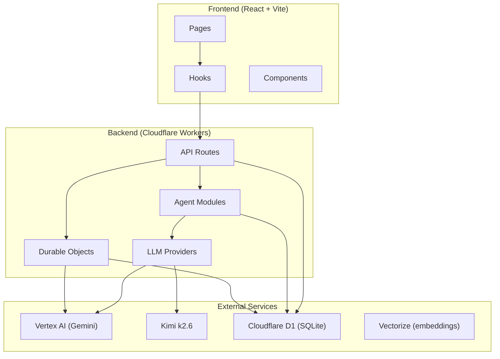
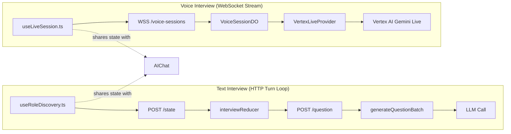
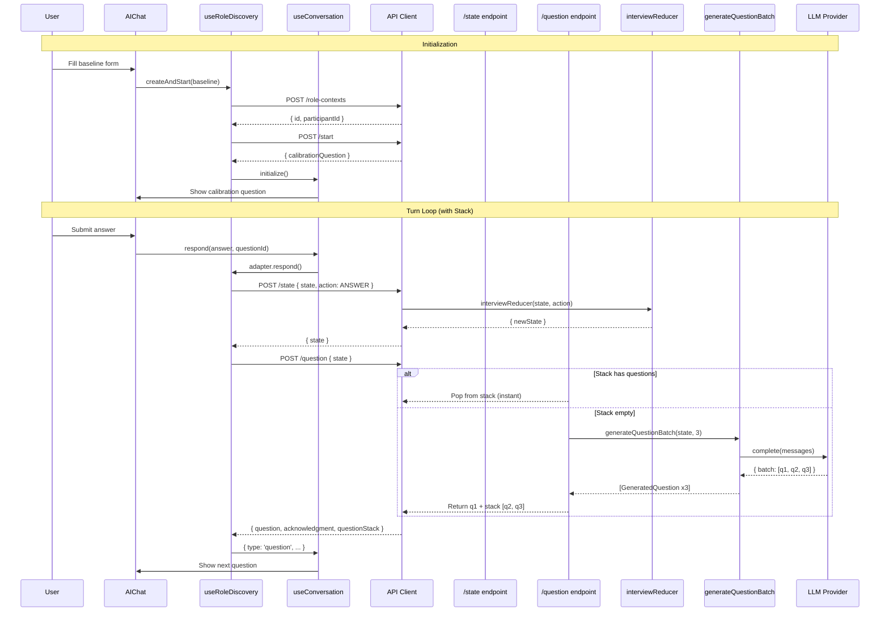
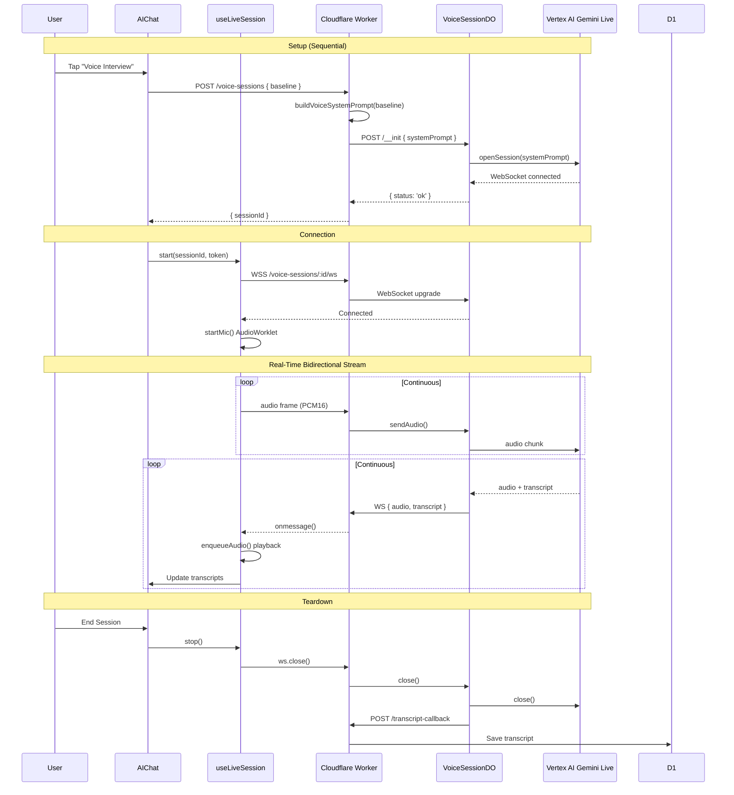
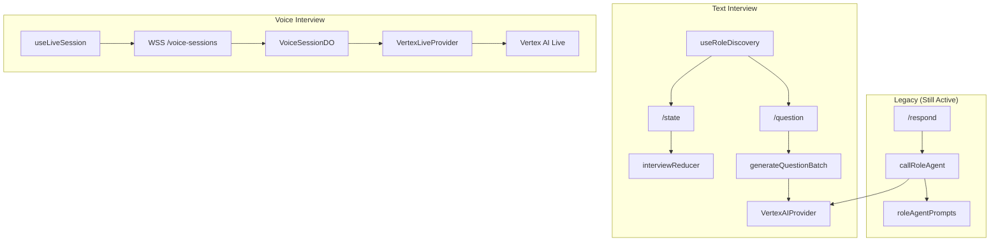

# PIPE System Architecture Overview

## 1. High-Level Components

## 2. Role Discovery — Two Separate Paths

## 3. Text Interview — Detailed Flow

## 4. Voice Interview — Detailed Flow

## 5. Component Inventory

### Frontend Hooks

| Hook | Purpose | Used By |
|------|---------|---------|
| `useRoleDiscovery` | Manages text interview state + adapter | `RoleDiscoveryPage` |
| `useConversation` | Generic conversation state machine | `useRoleDiscovery` |
| `useLiveSession` | Real-time voice WebSocket + audio | `AIChat` (live mode) |
| `useApiClient` | HTTP client with auth | All hooks |

### Backend Routes

| Route | File | Purpose |
|-------|------|---------|
| `POST /role-contexts` | `roleContexts.ts` | Create interview |
| `POST /start` | `roleContexts.ts` | Return calibration question |
| `POST /state` | `roleContexts.ts` | Run reducer |
| `POST /question` | `roleContexts.ts` | Generate next question (now with stack) |
| `POST /synthesize` | `roleContexts.ts` | Generate persona + JD |
| `POST /voice-sessions` | `voiceSessions.ts` | Create voice session |
| `GET /voice-sessions/:id/ws` | `voiceSessions.ts` | WebSocket upgrade |

### Backend Agents

| Agent | File | Used By |
|-------|------|---------|
| `interviewReducer` | `interview/reducer.ts` | `/state` endpoint |
| `generateQuestion` | `question/generator.ts` | `/question` SSE path |
| `generateQuestionBatch` | `question/generator.ts` | `/question` non-streaming path |
| `evaluateQuestion` | `question/eval.ts` | `/question` (disabled) |
| `synthesize` | `synthesis/generator.ts` | `/synthesize` endpoint |
| `callRoleAgent` | `roleAgent.ts` | `/respond` (legacy, still active) |

### Durable Objects

| DO | File | Purpose |
|----|------|---------|
| `VoiceSessionDO` | `VoiceSessionDO.ts` | Real-time voice proxy |

### LLM Providers

| Provider | File | Used By |
|----------|------|---------|
| `VertexAIProvider` | `vertexAIProvider.ts` | `generateQuestionBatch`, `synthesize` |
| `KimiProvider` | `kimiProvider.ts` | Fallback |
| `VertexLiveProvider` | `live/vertexLiveProvider.ts` | `VoiceSessionDO` |

## 6. What Uses What — Matrix

## 7. Key Architectural Facts

1. **Two interviews, zero shared code at runtime**
   - Text path: HTTP request/response, state machine, question stack
   - Voice path: WebSocket stream, single prompt, model-managed flow

2. **Legacy `/respond` is still active**
   - The old monolithic `callRoleAgent` handles the streaming path in `/respond`
   - The new state machine (`/state` + `/question`) handles the non-streaming path
   - Both exist simultaneously

3. **Voice agent has no stack**
   - The voice agent sends a single system prompt to Vertex AI and lets the model generate all questions internally
   - It cannot use the question stack because Vertex Live does not support structured JSON output or prompt replacement mid-session

4. **The question stack only helps text**
   - Batch generates 3 questions per LLM call
   - Serves questions 2 and 3 instantly (no LLM latency)
   - Reduces per-turn latency from ~7s to ~13ms for stacked questions
