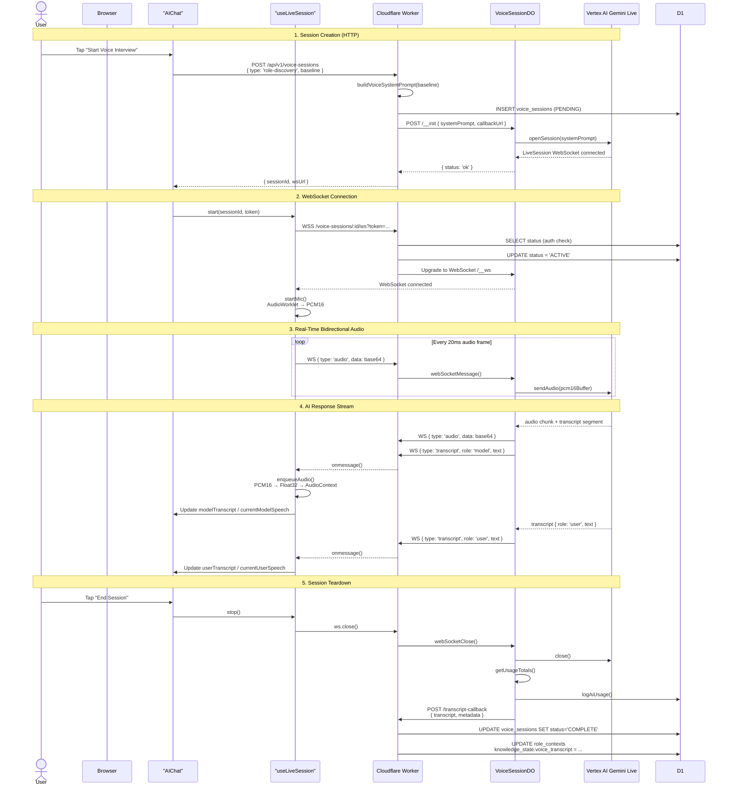

# Voice Agent Architecture

Real-time bidirectional voice interview flow using Vertex AI Gemini Live.

```mermaid
sequenceDiagram
    actor User
    participant Browser
    participant AIChat as "AIChat"
    participant useLive as "useLiveSession"
    participant Worker as Cloudflare Worker
    participant DO as VoiceSessionDO
    participant Vertex as Vertex AI Gemini Live

    %% Session creation
    Note over User,Vertex: 1. Session Creation (HTTP)
    User->>AIChat: Tap "Start Voice Interview"
    AIChat->>Worker: POST /api/v1/voice-sessions<br/>{ type: 'role-discovery', baseline }
    Worker->>Worker: buildVoiceSystemPrompt(baseline)
    Worker->>D1: INSERT voice_sessions (PENDING)
    Worker->>DO: POST /__init { systemPrompt, callbackUrl }
    DO->>Vertex: openSession(systemPrompt)
    Vertex-->>DO: LiveSession WebSocket connected
    DO-->>Worker: { status: 'ok' }
    Worker-->>AIChat: { sessionId, wsUrl }

    %% WebSocket connection
    Note over User,Vertex: 2. WebSocket Connection
    AIChat->>useLive: start(sessionId, token)
    useLive->>Worker: WSS /voice-sessions/:id/ws?token=...
    Worker->>D1: SELECT status (auth check)
    Worker->>D1: UPDATE status = 'ACTIVE'
    Worker->>DO: Upgrade to WebSocket /__ws
    DO-->>useLive: WebSocket connected
    useLive->>useLive: startMic()<br/>AudioWorklet → PCM16

    %% Real-time audio loop
    Note over User,Vertex: 3. Real-Time Bidirectional Audio
    loop Every 20ms audio frame
        useLive->>Worker: WS { type: 'audio', data: base64 }
        Worker->>DO: webSocketMessage()
        DO->>Vertex: sendAudio(pcm16Buffer)
    end

    %% AI response
    Note over User,Vertex: 4. AI Response Stream
    Vertex-->>DO: audio chunk + transcript segment
    DO->>Worker: WS { type: 'audio', data: base64 }
    DO->>Worker: WS { type: 'transcript', role: 'model', text }
    Worker-->>useLive: onmessage()
    useLive->>useLive: enqueueAudio()<br/>PCM16 → Float32 → AudioContext
    useLive->>AIChat: Update modelTranscript / currentModelSpeech

    %% User speech transcript
    Vertex-->>DO: transcript { role: 'user', text }
    DO->>Worker: WS { type: 'transcript', role: 'user', text }
    Worker-->>useLive: onmessage()
    useLive->>AIChat: Update userTranscript / currentUserSpeech

    %% Session end
    Note over User,Vertex: 5. Session Teardown
    User->>AIChat: Tap "End Session"
    AIChat->>useLive: stop()
    useLive->>Worker: ws.close()
    Worker->>DO: webSocketClose()
    DO->>Vertex: close()
    DO->>DO: getUsageTotals()
    DO->>D1: logAiUsage()
    DO->>Worker: POST /transcript-callback<br/>{ transcript, metadata }
    Worker->>D1: UPDATE voice_sessions SET status='COMPLETE'
    Worker->>D1: UPDATE role_contexts<br/>knowledge_state.voice_transcript = ...
```
